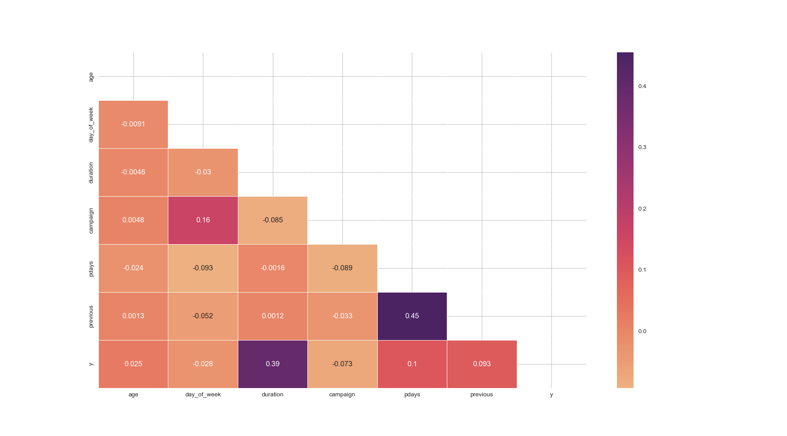

# Bank-Marketing

  
  
<em>Figure 1: Bank Marketing</em>

**Overall Summary:**
The dataset reveals that certain demographic factors (like job, marital status, and education), financial factors (like credit default, housing loan, and personal loan status), and behavioral factors (like contact communication type, last contact month, and duration of the last contact) significantly influence the likelihood of clients subscribing to a term deposit. Longer call durations and successful outcomes from previous campaigns are particularly strong predictors of subscription.

These insights can help the bank tailor its marketing strategies to target specific groups more effectively and optimize their campaign efforts.

# Business Problem 

for the Bank Marketing Dataset
The primary business problem addressed by the Bank Marketing Dataset is to improve the effectiveness of marketing campaigns for term deposits. The dataset contains information about various client attributes and past marketing interactions, which can be used to predict whether a client will subscribe to a term deposit.

# Problem Statement
Objective: To predict whether a client will subscribe to a term deposit based on their demographic, financial, and behavioral characteristics.

# Key Questions
- Who are the clients most likely to subscribe to a term deposit?
- What are the key factors influencing a client’s decision to subscribe?
- How can the bank improve its marketing strategies to increase subscription rates?

## Data source

- [UCI Bank Marketing](https://archive.ics.uci.edu/dataset/222/bank+marketing)

## Quick glance at the results

Correlation between the features.

**Key Insights:**
Duration of the call has the strongest positive correlation with the target variable y (0.395), suggesting that longer calls are more effective in securing subscriptions.
Campaign has a slight negative correlation with y (-0.073), indicating that clients contacted more frequently in the current campaign are less likely to subscribe.
Pdays and previous show positive correlations with y, suggesting that clients with longer intervals since the last contact and more previous contacts are more likely to subscribe.
