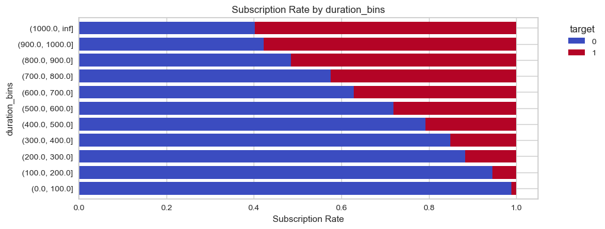
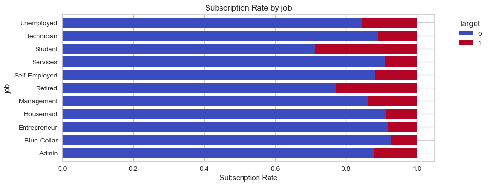

# Bank-Marketing

  
  
<em>Figure 1: Bank Marketing</em>

**Overall Summary:**
The dataset reveals that certain demographic factors (like job, marital status, and education), financial factors (like credit default, housing loan, and personal loan status), and behavioral factors (like contact communication type, last contact month, and duration of the last contact) significantly influence the likelihood of clients subscribing to a term deposit. Longer call durations and successful outcomes from previous campaigns are particularly strong predictors of subscription.

These insights can help the bank tailor its marketing strategies to target specific groups more effectively and optimize their campaign efforts.

# Business Problem 

for the Bank Marketing Dataset
The primary business problem addressed by the Bank Marketing Dataset is to improve the effectiveness of marketing campaigns for term deposits. The dataset contains information about various client attributes and past marketing interactions, which can be used to predict whether a client will subscribe to a term deposit.

# Problem Statement
Objective: To predict whether a client will subscribe to a term deposit based on their demographic, financial, and behavioral characteristics.

# Key Questions
- Who are the clients most likely to subscribe to a term deposit?
- What are the key factors influencing a client’s decision to subscribe?
- How can the bank improve its marketing strategies to increase subscription rates?

## Data source

- [UCI Bank Marketing](https://archive.ics.uci.edu/dataset/222/bank+marketing)

## Quick glance at the results

Correlation between the features.

**Key Insights:**
Duration of the call has the strongest positive correlation with the target variable y (0.395), suggesting that longer calls are more effective in securing subscriptions.
Campaign has a slight negative correlation with y (-0.073), indicating that clients contacted more frequently in the current campaign are less likely to subscribe.
Pdays and previous show positive correlations with y, suggesting that clients with longer intervals since the last contact and more previous contacts are more likely to subscribe.

Duration Bins vs target variable.

**Interpretation:**
As the duration of the last contact increases, the subscription rate also increases significantly.
For contacts lasting 1000 seconds or more, the subscription rate is the highest at 59.74%.
For very short contacts (0.0 to 100.0 seconds), the subscription rate is the lowest at 1.08%.
Longer calls likely indicate that the customer is engaged and interested, providing more opportunities for the agent to address concerns and highlight benefits

Job vs target variable.

**Interpretation:**
Students and Retired individuals have the highest subscription rates at 28.68% and 22.79%, respectively. This suggests that these groups are more likely to subscribe to the bank product compared to others.
Blue-Collar workers have the lowest subscription rate at 7.27%, indicating they are less likely to subscribe.
Management and Unemployed individuals also show relatively higher subscription rates at 13.76% and 15.50%, respectively.

Confusion matrix of Bagging classifier.

_confusion_matrix.png)

ROC curve of Bagging classifier.

_roc_curve.png)

Top 4 models (with default parameters)

| Model     	                | Precision score 	|
|-------------------	        |------------------	|
| Extra Trees         | 89%                    |
| Random Forest     	| 88% 	            |
| Bagging             | 88%                 |
| Gradient boosting    	        | 83% 	            |

